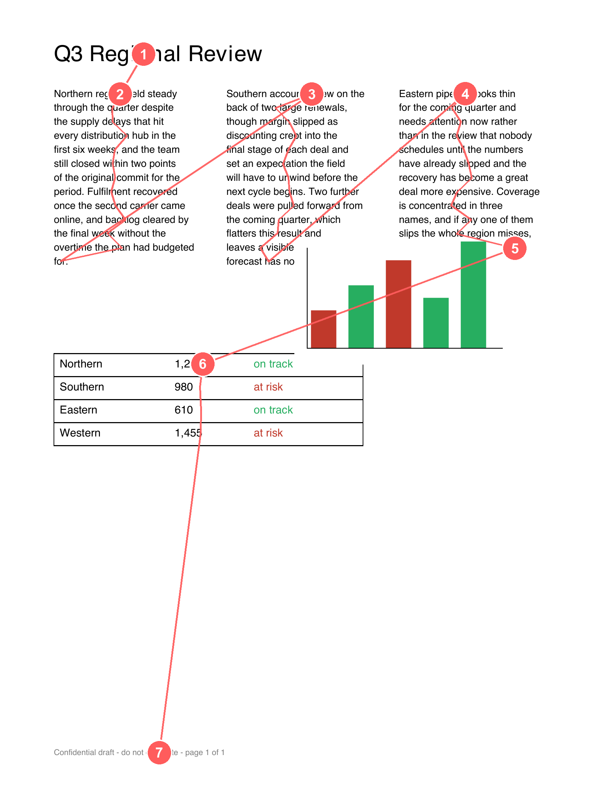

# Second Reader

> **You proofread it. Nobody read it the way they're about to.**

Second Reader opens a document the way the recipient's **assistive technology** will
open it — and hands it back to you *before* you send it. It reads the page aloud in
the order a screen reader announces it, highlights each word as it's spoken, shows
the page as a colour-blind reader sees it, explains what breaks in plain English —
and then **rebuilds the whole document, fixed and accessible**, which you can edit by
voice and download in the format you want.

> Built for the AWS Builder Center weekend challenge — *turn one annoying task into an app.*

---

## The annoying task

The pre-send accessibility check everyone means to do and nobody does — because doing
it properly means learning what a screen reader does to a merged table cell. So we
send the deck and hope. And every accessibility checker gives back a list of rule
numbers (`1.3.1`, `1.4.3`) that are impossible to picture, so they get ignored.

**Second Reader's whole idea: every other checker hands you rule numbers. This hands
you the experience.**

## What it does

Upload a PDF (any length) and get back what you can't currently see:

1. **Reading-order audio** — the whole document read aloud in the exact order a screen reader announces it, across every page.
2. **Word-level synced highlighting** — each word lights up on the page as it's spoken; on a multi-page document the viewer follows the audio from page to page.
3. **Reading-order trail** — a numbered line over each page showing the announcement order zig-zag across a multi-column layout (the whole point, in one still image).
4. **Colour-blind view** — the same page under deuteranopia / protanopia / tritanopia, with an original↔simulated slider.
5. **Plain-English findings** — what breaks and the *human consequence*, plus **generated alt text** for figures, ready to paste.

Then it doesn't just tell you — it **fixes it**:

6. **Accessible version (remediation agent)** — a Bedrock agent rebuilds the document as clean, semantic HTML: one logical reading order, real headings, a table with header cells, and images with the generated alt text.
7. **Edit by voice or text** — speak (or type) an addition like *"add a one-line summary at the top"* and the agent applies it to the accessible document.
8. **Download in multiple formats** — the fixed document as **HTML, Markdown, or plain text**.

Plus a **screen-reader speed toggle** (1× / 1.75× / 2.5×) — because real screen-reader
users listen at 2–3×, and hearing it is the moment it lands.

## The one feature that makes it stand out

It **shows you instead of scolding you.** You *hear* your careful three-column layout
collapse into nonsense, and the reading-order trail freezes that collapse into a
single image. You fix what you've experienced; you ignore a list of violations.

---

## Demo

- **Live app:** https://d2tlyziog3y8ws.cloudfront.net
- **Sample documents** — download one and drop it on the app (or use **Choose PDF**):
  - `Second-Reader-sample.pdf` — a one-page deck that packs every failure at once (three mis-linearising columns, a table with no header, a chart with no alt text, a red/green status column).
  - `Second-Reader-sample-multipage.pdf` — a two-page version, to see the pager follow the audio across pages.



*The red line is the order a screen reader announces the page: down column one, then a
leap back up to column two, then column three. A neat layout, announced as three
disconnected monologues.*

---

## AWS services used

| Service | Role |
|---|---|
| **Amazon Textract** | `AnalyzeDocument` (sync) with `FeatureTypes=['LAYOUT','TABLES']` — returns blocks **in reading order** with a bounding box per word, and table cells for the header-row check. The core of the app. |
| **Amazon Polly** | `SynthesizeSpeech` ×2 (neural) — one MP3, one JSON with word **speech marks**, used to sync the highlight to the audio without drift. Chunked to stay under the sync limit and concatenated into one read-through. |
| **Amazon Bedrock** | Nova Lite, four generation jobs: phrases each finding as a human consequence; (vision) writes alt text from a figure image; **rebuilds the document as accessible HTML** (remediation); and **applies voice/text edits**. Generation only, never judgement. |
| **AWS Lambda** | One Python function behind a **Function URL**, with four actions: analyse (`images`), alt text (`altFor`), remediate, and edit. |
| **Amazon S3** | Two private buckets — generated audio, and the static frontend. |
| **Amazon CloudFront** | Serves the frontend over HTTPS via Origin Access Control. |
| **AWS SAM / CloudFormation** | One `template.yaml` deploys everything. |

Everything runs in **us-east-1**.

## How it works

```
Browser (pdf.js renders EVERY page → JPEGs)      Lambda (Function URL), 4 actions
     │  POST { images:[…] }                  ┌─▶ analyse:  for each page →
     ▼                                       │     Textract AnalyzeDocument (LAYOUT+TABLES)
  CloudFront + S3 ──serves the site          │     linearise → per-page sequence + word boxes
     ▲                                       │     deterministic findings (aggregated)
     │  { pages[], timeline,                 │     Polly ×N → mp3 + word speech marks
     │    findings, audioUrl } ◀─────────────┤     byte-offset map → one word timeline
     │  { alt }  ◀──POST { altFor }──────────┤   alt text:  Bedrock Nova (vision) on a figure crop
     │  { html } ◀──POST { remediate }───────┤   remediate: Bedrock Nova → accessible HTML
     │  { html } ◀──POST { edit }────────────┘   edit:      Bedrock Nova applies a spoken/typed change
     ▼                                           mp3 → S3 (presigned URL)
  pager · highlighter · trail · colour-blind · speed · findings · accessible version · voice edit · download
```

The browser renders each page and sends it as a **compressed JPEG**, not the raw PDF —
that sidesteps sync Textract's single-page limit (so multi-page documents work), fits
many pages in one request, and keeps the highlight boxes aligned with what's on screen.
Word indices and the audio timeline run continuously across all pages.

Full technical detail — linearisation, the speech-mark byte-offset alignment, the
findings rules, the colour matrices, the build decisions — is in
[`DOCUMENTATION.md`](DOCUMENTATION.md).

---

## Deploy it yourself

**Prerequisites:** an AWS account, AWS CLI configured, [AWS SAM CLI](https://docs.aws.amazon.com/serverless-application-model/latest/developerguide/install-sam-cli.html),
Python 3.12+, and **Bedrock model access to Amazon Nova Lite** enabled in us-east-1.

```bash
export AWS_PROFILE=<your-profile> AWS_REGION=us-east-1

# 1. deploy backend + hosting (S3, Lambda + Function URL, CloudFront)
sam build && sam deploy --guided --stack-name second-reader
#   ^ first run only; accept defaults. Note the FunctionUrl and SiteUrl outputs.

# 2. paste the FunctionUrl output into FN_URL in frontend/index.html

# 3. push the frontend to the site bucket
SITE=$(aws cloudformation describe-stacks --stack-name second-reader \
  --query "Stacks[0].Outputs[?OutputKey=='SiteBucket'].OutputValue" --output text)
aws s3 cp frontend/index.html s3://$SITE/index.html --content-type text/html --cache-control no-cache

# 4. open the SiteUrl output in your browser
```

Local development (no deploy needed):

```bash
python3 fixtures/make_fixture.py   # (re)build the adversarial sample PDF
python3 fixtures/run_local.py      # run the whole pipeline locally against it
python3 -m http.server 8000        # then open http://localhost:8000/frontend/index.html
```

## Cost

A demo run costs **well under a cent** — Textract LAYOUT ~$0.015/page, Polly neural
~$16 per million characters (a page is a rounding error), Nova Lite fractions of a
cent, and S3/Lambda/CloudFront within free tier.

**Teardown:** empty the two buckets, then `sam delete --stack-name second-reader`.

## Repository layout

```
src/app.py                          the entire backend (analyse / alt / remediate / edit actions)
template.yaml                       SAM: buckets, Lambda + Function URL, CloudFront + OAC, scoped IAM
frontend/index.html                 the whole UI (pdf.js, pager, highlighter, trail, colour-blind,
                                    speed, findings, remediation, voice edit, downloads)
fixtures/                           the adversarial sample + local test/validation scripts
Second-Reader-sample.pdf            one-page sample to upload
Second-Reader-sample-multipage.pdf  two-page sample (shows the pager following the audio)
DOCUMENTATION.md                    full technical reference
```

---

*Design principle throughout: **detection is deterministic** (rules in code); the
language model is used only where it belongs — **generation**: phrasing findings,
describing images, rebuilding the document, and applying edits — never to decide
whether something is a defect.*
